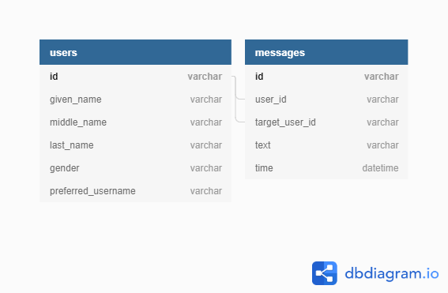

# Chatroom designed for pslib

- Basic chat appliaction with server-side app written in **ASP.NET Core** and client app in **React**
- Application uses authority server of my school so you may need account with special claims
- Application has been tested in Google chrome but should work for other browsers 

### Client-side 

- React application is using hooks with context mechanism. I have chosen this way of programming because it is similar to **Redux** but it is way easier to use
- I use *oidc-client* library to access authority server site

### Server-side

- I use server app to communicate with client applications via **REST API** and **web sockets**
- Server application provides protected endpoints which only authorized client can be connected to
- I have selected a library called *SignalR* for web socket implementation for streaming incoming messages to clients
- C# app uses *Entity framework* to connect to *MSSQL* database and retrieve data via **LINQ**
- Database design is shown on following picture :

©Martin Přívozník - SPŠSE a VOŠ Liberec